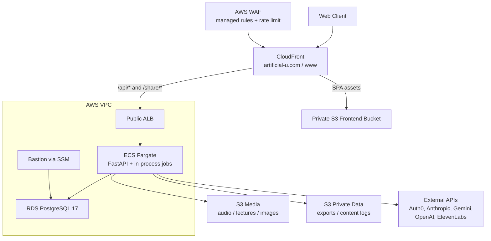

# ArtificialU System Architecture

This document provides a comprehensive overview of the ArtificialU system architecture, explaining the key components, technology stack, and how they interact.

## Project Overview

ArtificialU is an AI-powered educational content platform that generates university lectures with distinct professor personalities, converting them to audio for an immersive learning experience. The system creates virtual professors with unique teaching styles who deliver engaging lectures across various academic disciplines.

## Technology Stack

### Backend

- **Runtime**: Python 3.13+
- **Web Framework**: FastAPI (async REST API)
- **Database**: PostgreSQL 17
- **ORM**: SQLAlchemy 2.0
- **Migrations**: Alembic
- **Validation**: Pydantic v2
- **Authentication**: Auth0 (JWT-based)
- **Job Queue**: Custom async worker with PostgreSQL-backed job system
- **Package Management**: Hatch (with optional pip-tools for lockfiles)

### Frontend

- **Framework**: SolidJS (reactive UI library)
- **Language**: TypeScript
- **Build Tool**: Vite
- **Router**: @solidjs/router
- **UI Components**: Kobalte (headless UI library)
- **Styling**: TailwindCSS v4 + PostCSS
- **Authentication**: Auth0 SPA SDK
- **HTTP Client**: Custom fetch wrapper with timeout/retry logic
- **State Management**: SolidJS signals and contexts

### AI & Integrations

- **Content Generation**:
  - Anthropic Claude API (primary)
  - Google Gemini API
  - OpenAI GPT API
- **Text-to-Speech**:
  - ElevenLabs API (primary)
- **Image Generation**: Integration-ready (professor portraits)
- **Storage**: MinIO (development) / AWS S3 (production)

### Infrastructure

- **Local Orchestration**: Docker Compose for PostgreSQL and MinIO during development
- **Production Infrastructure**: AWS CDK in Python
- **Production Compute**: ECS on Fargate behind an internet-facing Application Load Balancer
- **Production Delivery**: CloudFront with Route 53, ACM, AWS WAF, and S3-hosted frontend assets
- **Production Database**: Amazon RDS PostgreSQL 17
- **Production Storage**: Amazon S3 buckets for audio, lectures, images, exports, content logs, and frontend assets
- **CI/CD**: GitHub Actions deployment workflow for the `prod` branch

## System Architecture

In production, CloudFront is the public entry point for both the static web client and backend routes:



The application itself follows a modern three-tier architecture with clear separation of concerns:

```
┌─────────────────────────────────────────────────────────────┐
│                     Web Client (SolidJS)                    │
│  - Responsive UI with multiple themes                       │
│  - Real-time job status updates via SSE                     │
│  - Auth0 authentication integration                         │
└───────────────────────────┬─────────────────────────────────┘
                            │ HTTPS/REST API
┌───────────────────────────┴─────────────────────────────────┐
│                    FastAPI Backend                          │
│  ┌─────────────────────────────────────────────────────┐    │
│  │              API Layer (Routers)                    │    │
│  │  /auth  /courses  /departments  /professors         │    │
│  │  /lectures  /topics  /voices  /jobs  /health        │    │
│  └──────────────────────┬──────────────────────────────┘    │
│  ┌──────────────────────┴──────────────────────────────┐    │
│  │           Service Layer (Business Logic)            │    │
│  │  - API Services (request handling)                  │    │
│  │  - Core Services (domain logic)                     │    │
│  │  - Generator Services (AI workflows)                │    │
│  │  - Job Enqueue Service (background tasks)           │    │
│  └──────────────────────┬──────────────────────────────┘    │
│  ┌──────────────────────┴──────────────────────────────┐    │
│  │          Repository Layer (Data Access)             │    │
│  │  - Repository Factory (dependency injection)        │    │
│  │  - Entity Repositories (CRUD operations)            │    │
│  │  - SQLAlchemy Models & Sessions                     │    │
│  └──────────────────────┬──────────────────────────────┘    │
│                         │                                   │
│  ┌──────────────────────┴───────────────────────────────┐   │
│  │            Background Worker System                  │   │
│  │  - Async job processing                              │   │
│  │  - Rate limiting & concurrency control               │   │
│  │  - Job event broadcasting (SSE)                      │   │
│  └──────────────────────────────────────────────────────┘   │
└───────────────────────────┬─────────────────────────────────┘
                            │
    ┌───────────────────────┼───────────────────────────┐
    │                       │                           │
┌───▼────────┐  ┌───────────▼────────┐  ┌──────────────▼──────┐
│ PostgreSQL │  │ MinIO/S3 Storage   │  │ External APIs       │
│            │  │ - Audio files      │  │ - Anthropic Claude  │
│ - Courses  │  │ - Lecture content  │  │ - ElevenLabs TTS    │
│ - Lectures │  │ - Professor images │  │ - Google Gemini     │
│ - Topics   │  └────────────────────┘  │ - OpenAI GPT        │
│ - Jobs     │                          │ - Auth0             │
│ - Students │                          └─────────────────────┘
└────────────┘
```

## Core Domain Model

The system revolves around these primary entities:

### Academic Entities

- **Department**: Academic departments (Computer Science, Philosophy, etc.)
  - Has many professors and courses
  - Defines the organizational structure

- **Professor**: Virtual faculty members with unique personalities
  - Personality traits, teaching style, background
  - Voice mapping (ElevenLabs voice ID)
  - Department affiliation
  - Profile images (planned)

- **Course**: Academic courses with structured content
  - Course code, title, description
  - Associated with a professor and department
  - Contains multiple topics across weeks

- **Topic**: Weekly course subjects
  - Ordered within a course week
  - Can have multiple lecture implementations
  - Stores content metadata (JSON)

- **Lecture**: Individual class sessions
  - Generated content in professor's style
  - Audio file URLs (after TTS conversion)
  - Associated with a specific topic

### Supporting Entities

- **Voice**: ElevenLabs voice configurations
  - Voice characteristics (accent, gender, age)
  - Quality ratings and use counts
  - Mapped to professors

- **Student**: User accounts
  - Auth0 integration (auth0_sub)
  - Email and profile information
  - Access control for content creation

- **Job**: Background task queue
  - Job types: content generation, audio conversion
  - Status tracking and error handling
  - Result storage (JSONB)

## API Architecture

### FastAPI Application Structure

```
artificial_u/api/
├── app.py                # Application factory and configuration
├── config.py             # API-specific settings
├── dependencies.py       # Dependency injection setup
├── events.py             # SSE event hub for real-time updates
├── worker.py             # Background job processor
├── routers/              # API endpoint definitions
│   ├── auth.py           # Authentication endpoints
│   ├── courses.py        # Course CRUD and generation
│   ├── departments.py    # Department management
│   ├── lectures.py       # Lecture generation and audio
│   ├── professors.py     # Professor management
│   ├── topics.py         # Topic operations
│   ├── voices.py         # Voice management
│   └── jobs.py           # Job queue monitoring
├── services/             # Business logic layer
│   ├── base_service.py   # Generic service patterns
│   ├── course_service.py
│   ├── lecture_service.py
│   └── ... (other services)
├── models/               # Pydantic request/response models
├── middlewares/          # Request/response processing
│   ├── cors_middleware.py
│   ├── error_handler.py
│   └── logging_middleware.py
└── security/             # Authentication/authorization
    └── auth0.py          # JWT validation
```

### API Features

- **RESTful Design**: Resource-based URLs with standard HTTP methods
- **Pagination**: Consistent pagination for list endpoints
- **Filtering & Sorting**: Query parameter-based filtering
- **Validation**: Pydantic models for request/response validation
- **Error Handling**: Standardized error responses with error codes
- **OpenAPI Documentation**: Auto-generated at `/api/docs`
- **Real-time Updates**: SSE endpoint for job status updates
- **Authentication**: JWT-based Auth0 integration

### Service Layer Architecture

The service layer is organized into three types:

1. **API Services** (`artificial_u/api/services/`)
   - Handle HTTP request/response logic
   - Coordinate between multiple core services
   - Manage pagination and filtering
   - Example: `CourseApiService`, `ProfessorApiService`

2. **Core Services** (`artificial_u/services/`)
   - Implement domain business logic
   - Direct repository interactions
   - No HTTP-specific concerns
   - Example: `CourseService`, `ContentService`

3. **Generator Services** (`artificial_u/services/`)
   - Orchestrate AI content generation workflows
   - Manage multi-step generation processes
   - Queue background jobs
   - Example: `CourseGeneratorService`, `LectureGeneratorService`

## Web Client Architecture

### SolidJS Application Structure

```
web/src/
├── App.tsx               # Main application component with routes
├── index.tsx             # Application entry point
├── api/                  # API integration layer
│   ├── client.ts         # HTTP client with auth & error handling
│   ├── config.ts         # API configuration
│   └── services/         # Service-specific API calls
├── auth/                 # Authentication
│   ├── AuthProvider.tsx  # Auth0 context provider
│   ├── RequireAuth.tsx   # Route protection
│   └── auth0.ts          # Auth0 client setup
├── components/           # Reusable UI components
│   ├── ui/               # Base UI components (buttons, forms, etc.)
│   ├── Layout.tsx        # Application layout
│   ├── NavBar.tsx        # Navigation
│   └── ... (feature components)
├── pages/                # Route page components
│   ├── Home.tsx
│   ├── Courses.tsx
│   ├── CourseDetail.tsx
│   ├── LectureDetail.tsx
│   └── ... (other pages)
├── utils/                # Utilities
│   ├── theme.ts          # Theme management
│   ├── job-events-hub.ts # SSE job updates
│   └── ... (other utilities)
└── styles/               # CSS and styling
```

### Client Features

- **Reactive UI**: SolidJS signals for state management
- **Code Splitting**: Lazy loading of route components
- **Theming System**: Multiple themes (dark-academia, vaporwave, etc.)
- **Responsive Design**: Mobile-first with TailwindCSS
- **Authentication**: Auth0 SPA SDK with cross-tab sync
- **Real-time Updates**: Server-Sent Events for job status
- **Error Boundaries**: Graceful error handling
- **Type Safety**: Full TypeScript coverage

## Infrastructure Services

### Database Layer

- **PostgreSQL 17**: Primary data store
- **Alembic Migrations**: Version-controlled schema changes
- **SQLAlchemy ORM**: Type-safe database access
- **Connection Pooling**: Optimized connection management

### Storage Layer

- **MinIO/S3**: Object storage for files
  - Audio files from TTS conversion
  - Lecture content backups
  - Professor profile images
- **Bucket Organization**:
  - Development uses MinIO-compatible local storage.
  - Production uses CDK-managed S3 buckets for audio, lectures, images, exports, and content logs.
  - The production audio, lectures, and images buckets are public-readable with CORS for the application domains.
  - The exports and content logs buckets are private application buckets.
  - A separate private frontend bucket stores the SolidJS build output for CloudFront.

### Job Processing System

- **PostgreSQL-backed Queue**: Jobs table with status tracking
- **Async Worker**: Background processing with concurrency control. In the current CDK production stack, this runs in the API service process rather than as a separate ECS worker service.
- **Rate Limiting**: API rate limit compliance (configurable RPS)
- **Event Broadcasting**: Real-time status updates via SSE
- **Job Types**:
  - Content generation (professors, courses, lectures)
  - Audio conversion (TTS processing)
  - Voice assignment and mapping

### Authentication & Security

- **Auth0 Integration**:
  - JWT-based authentication
  - RS256 token validation
  - Scope-based authorization
- **Security Middleware**:
  - CORS configuration
  - Request logging
  - Error sanitization

## Key Service Components

### Audio Processing Pipeline

The audio processing system consists of specialized components working together:

#### SpeechProcessor

- **Text Enhancement**: Adds pronunciation hints for technical terms
- **Mathematical Notation**: Converts formulas to speakable text
- **Discipline-Specific**: Applies department-specific enhancements
- **Chunking**: Splits content into optimal segments for TTS

#### VoiceMapper

- **Voice Matching**: Maps professor attributes to voice characteristics
- **Quality Selection**: Prioritizes high-quality voices
- **Fallback Logic**: Provides alternatives when ideal match unavailable
- **Attribute Mapping**: Gender, accent, age to voice categories

#### ElevenLabsClient

- **API Integration**: Direct interface to ElevenLabs services
- **Voice Management**: Retrieves and caches voice information
- **TTS Conversion**: Handles text-to-speech requests
- **Error Handling**: Retry logic and rate limiting

#### TTSService

- **Orchestration**: Coordinates the complete TTS workflow
- **File Management**: Handles audio storage and retrieval
- **Caching**: Prevents duplicate conversions
- **Playback Support**: Provides audio streaming capabilities

### Content Generation Services

#### ContentService

- **AI Model Selection**: Routes to appropriate provider (Claude, GPT, etc.)
- **Prompt Engineering**: Maintains consistent generation patterns
- **Response Processing**: Formats and validates AI responses
- **Context Management**: Maintains conversation history

#### UniversitySystem

- **Central Orchestrator**: Integrates all service components
- **Workflow Management**: Coordinates multi-step operations
- **State Management**: Tracks generation progress
- **Error Recovery**: Handles failures gracefully

### Repository Pattern

- **Factory Pattern**: Centralized repository creation
- **Entity Repositories**: One repository per domain entity
- **Transaction Management**: Ensures data consistency
- **Query Optimization**: Efficient data retrieval patterns

## Development Workflow

### Environment Management

- **Hatch**: Python environment and dependency management
- **Docker Compose**: Local service orchestration
- **Configuration**: Environment variables via `.env` files
- **Hot Reload**: Development servers with auto-restart

### Code Quality

- **Linting**: Flake8 (Python), ESLint + BiomeJS (TypeScript)
- **Formatting**: Black (Python), BiomeJS (TypeScript)
- **Type Checking**: MyPy (Python), TypeScript
- **Testing**: Pytest (backend), Vitest (frontend)
- **Pre-commit Hooks**: Automated quality checks

### API Development Flow

1. Define Pydantic models for request/response
2. Create router endpoints with OpenAPI documentation
3. Implement service layer business logic
4. Add repository methods for data access
5. Queue background jobs for long operations
6. Write integration tests

### Frontend Development Flow

1. Create TypeScript interfaces for API types
2. Implement API service functions
3. Build SolidJS components with Kobalte UI
4. Add routing and page components
5. Style with TailwindCSS utilities
6. Test across multiple themes

## Content Generation Pipeline

### Lecture Generation Workflow

1. **Course Creation**:
   - Generate or assign professor
   - Create course topics
   - Store in PostgreSQL

2. **Content Generation**:
   - Queue job for lecture generation
   - Select appropriate AI model
   - Generate content in professor's style
   - Apply discipline-specific enhancements

3. **Audio Conversion**:
   - Map professor to voice
   - Process text for optimal TTS
   - Convert via ElevenLabs API
   - Store audio in S3/MinIO

4. **Delivery**:
   - Serve content via API
   - Stream audio to web client
   - Track usage and feedback

### AI Model Integration

The system supports multiple AI providers through a unified interface:

- Model selection based on task requirements
- Fallback chains for reliability
- Response caching for efficiency
- Prompt engineering for consistency

## Summary

ArtificialU is a modern, full-stack application built with a focus on:

- **Clean Architecture**: Clear separation of concerns across layers
- **Developer Experience**: Modern tooling and hot reload
- **Type Safety**: End-to-end type checking
- **Scalability**: Async processing, job queues, Fargate-based API hosting, and S3-backed object storage
- **Extensibility**: Modular design for easy feature addition
- **User Experience**: Responsive UI with real-time updates

The architecture supports rapid iteration while maintaining code quality, with local Docker services for development and a CDK-managed AWS production deployment.
