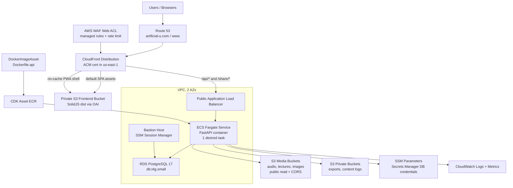

# Deployment

This document outlines the deployment process for the Artificial University stack to Amazon Web Services (AWS) using the AWS Cloud Development Kit (CDK).

## Architecture Overview

The AWS infrastructure is defined as code using the Python CDK and consists of the following core components:

- **Amazon VPC**: A dedicated Virtual Private Cloud (VPC) to host all network-isolated resources.
- **Amazon RDS**: A managed PostgreSQL 17 database instance (`db.t4g.small`) for the application's data persistence.
- **Amazon EC2 Bastion Host**: A small Amazon Linux bastion host for secure database access through AWS Systems Manager Session Manager.
- **Amazon S3**:
  - Three public-read, versioned media buckets for `audio`, `lectures`, and `images`, with CORS configured for the production domains.
  - Two retained private buckets for `exports` and `content logs`.
  - One private frontend bucket for the built SolidJS assets. CloudFront reads it through an origin access identity.
- **Amazon ECS on AWS Fargate**: A serverless compute engine to run the FastAPI backend container without managing servers. The current stack runs a single ALB-fronted service and relies on in-process background job processing rather than a separate worker service.
- **Application Load Balancer (ALB)**: An internet-facing ALB that fronts the ECS service. The ALB must be public for CloudFront to reach it, as CloudFront cannot connect to internal (VPC-only) load balancers.
- **Amazon CloudFront**: A global Content Delivery Network (CDN) that provides the public entry point to the application. It is configured with two origins:
    1. The frontend S3 bucket (default behavior) to serve the web application.
    2. The public ALB to route `/api/*` requests and `/share/*` unfurl pages to the backend ECS service.
  - SPA fallback responses route S3 `403` and `404` responses to `index.html`.
  - PWA shell files (`index.html`, `sw.js`, Workbox files, `manifest.json`, etc.) use a no-cache policy, while versioned static assets use optimized caching.
- **AWS WAF**: A CloudFront-scoped web ACL provides basic application-layer protection using AWS managed rule groups and a simple blanket per-IP rate limit.
- **Route 53 and ACM**: A hosted zone for `artificial-u.com`, alias records for the apex and `www`, and a DNS-validated certificate in `us-east-1`.
- **AWS Secrets Manager and SSM Parameter Store**: Secrets Manager holds RDS credentials generated by CDK. SSM Parameter Store holds application API keys and Auth0 configuration.
- **Amazon ECR/CDK Assets**: CDK builds `Dockerfile.api` from the repository root as a Docker image asset and publishes it to the CDK asset ECR repository.
- **Amazon CloudWatch**: ECS container logs and custom application metrics are emitted to CloudWatch.

This architecture decouples the frontend and backend, with CloudFront acting as the primary public entry point and routing traffic by path.



### WAF Baseline

The CDK stack attaches an AWS WAFv2 web ACL directly to the CloudFront distribution. Because the protected resource is CloudFront, the web ACL must be created in `us-east-1`; the stack is already deployed there for the CloudFront ACM certificate.

The current baseline is intentionally small and managed:

- `AWSManagedRulesAmazonIpReputationList`: blocks sources that AWS threat intelligence associates with bots or other malicious activity.
- `AWSManagedRulesKnownBadInputsRuleSet`: blocks request patterns commonly associated with exploitation or vulnerability discovery.
- `AWSManagedRulesCommonRuleSet`: covers broadly applicable web application risks such as common OWASP-style inputs.
- `BlanketIpRateLimit`: blocks a single source IP after 1,000 requests in the AWS WAF rate evaluation window.

CloudWatch metrics and sampled requests are enabled for the web ACL and each rule. If a managed rule causes false positives, inspect the sampled requests first, then either add a scoped exception or move that specific rule to count mode before disabling broader protections.

---

## Prerequisites

Before deploying, ensure you have the following installed and configured:

1. **AWS CLI**: Installed and configured with credentials for your AWS account.

    ```bash
    aws configure
    ```

2. **Node.js and npm**: Required to install the CDK CLI.
3. **AWS CDK CLI**:

    ```bash
    npm install -g aws-cdk
    ```

4. **Python 3.13+ and Hatch**: For managing the Python environment. [[memory:6174773]]
5. **Docker**: The CDK will use Docker to build the API container image locally before publishing it as a CDK image asset.
6. **Built frontend assets**: The stack deploys `web/dist` into the frontend bucket, so run the frontend build before deploying locally:

    ```bash
    cd web
    pnpm build
    ```

---

## Deployment Steps

The entire deployment process is managed by the CDK.

### 1. Bootstrap your AWS Environment

If you've never used CDK in this AWS account and region before, you need to bootstrap it. This one-time command provisions the necessary resources for CDK to perform deployments.

```bash
cdk bootstrap
```

### 2. Install Dependencies

Navigate to the `cdk/` directory and install the required Python packages.

```bash
cd cdk
pip install -r requirements.txt
```

### 3. (Optional) Synthesize the CloudFormation Template

You can preview the AWS resources that the CDK will create by running `cdk synth`. This generates a CloudFormation template.

```bash
cdk synth
```

### 4. Deploy the Stack

Deploy the infrastructure to your AWS account. The CDK will build the Docker image, publish it as an asset, upload the current `web/dist` contents to S3, and provision all AWS resources defined in the stack.

```bash
cdk deploy
```

The command will display progress and ask for confirmation before making changes. Once complete, it outputs the Route 53 nameservers, bastion instance ID, and database endpoint. The public application URL is the configured custom domain after DNS is delegated to the hosted zone.

### 5. Post-Deployment: Configure Secrets

The CDK stack expects several application secrets to be present in AWS SSM Parameter Store for the backend application to function correctly. You must create these parameters in the same AWS region where you deployed the stack. Database credentials are generated by the RDS construct and stored in AWS Secrets Manager automatically.

Create the following SSM Parameters of type `String`:

- `/artificial-u/prod/ANTHROPIC_API_KEY`
- `/artificial-u/prod/ELEVENLABS_API_KEY`
- `/artificial-u/prod/MISTRAL_API_KEY`
- `/artificial-u/prod/XAI_API_KEY`
- `/artificial-u/prod/GOOGLE_API_KEY`
- `/artificial-u/prod/OPENAI_API_KEY`
- `/artificial-u/prod/AUTH0_DOMAIN`
- `/artificial-u/prod/AUTH0_AUDIENCE`

You can create them using the AWS Management Console or the AWS CLI:

```bash
aws ssm put-parameter --name "/artificial-u/prod/OPENAI_API_KEY" --value "your-api-key" --type "String"
```

After setting or changing SSM parameters, restart the ECS service for the new values to be injected into running containers. You can do this from the ECS console by updating the service and forcing a new deployment.

---

## CI/CD Automation with GitHub Actions

This repository includes a GitHub Actions workflow file at `.github/workflows/deploy.yml` that automates the deployment process. On every push to the `prod` branch, the workflow will automatically build the frontend, build the container image, and deploy the CDK stack.

### CI/CD Prerequisites

To enable the workflow to securely authenticate with your AWS account, you need to:

1. **Configure an OIDC identity provider in AWS IAM.** This establishes a trust relationship between your AWS account and GitHub Actions. [Follow the official AWS guide for this one-time setup.](https://docs.aws.amazon.com/IAM/latest/UserGuide/id_roles_providers_create_oidc.html)

2. **Create an IAM Role for GitHub Actions.** This role will have the permissions necessary to deploy your CDK stack. Attach the `AdministratorAccess` policy for simplicity, or create a more fine-grained policy for production. The key is to configure the role's trust policy to allow GitHub's OIDC provider to assume it.

    **Example Trust Policy:**

    ```json
    {
        "Version": "2012-10-17",
        "Statement": [
            {
                "Effect": "Allow",
                "Principal": {
                    "Federated": "arn:aws:iam::YOUR_AWS_ACCOUNT_ID:oidc-provider/token.actions.githubusercontent.com"
                },
                "Action": "sts:AssumeRoleWithWebIdentity",
                "Condition": {
                    "StringLike": {
                        "token.actions.githubusercontent.com:sub": "repo:your-github-org/your-repo-name:*"
                    }
                }
            }
        ]
    }
    ```

    Replace `YOUR_AWS_ACCOUNT_ID`, `your-github-org`, and `your-repo-name`.

3. **Create GitHub Secrets.** In your GitHub repository settings, go to `Secrets and variables` > `Actions` and create the following repository secrets:
   - `AWS_ROLE_ARN`: The ARN of the IAM role you just created
   - `VITE_AUTH0_DOMAIN`: Your Auth0 domain (e.g., `your-domain.auth0.com`)
   - `VITE_AUTH0_CLIENT_ID`: Your Auth0 application client ID
   - `VITE_AUTH0_AUDIENCE`: Your Auth0 API audience/identifier
   - `VITE_PLAUSIBLE_DOMAIN`: Your public domain, to enable Plausible Analytics tracking

Once these steps are complete, any push to `prod` will automatically trigger a deployment.

---

## Using a Custom Domain (e.g., artificial-u.com)

To associate your application with a custom domain, you need to perform a few manual steps after the initial deployment.

**Important Note on AWS Region**: To use an ACM certificate with CloudFront, the certificate must be created in the **us-east-1 (N. Virginia)** region. For simplicity, this guide assumes your entire CDK stack is deployed to `us-east-1`. Please ensure your AWS profile and CI/CD pipeline are configured for this region.

### 1. Deploy the Stack

Run `cdk deploy`. After a successful deployment, the CDK will output a list of nameservers. It will look something like this:

```txt
Outputs:
CdkStack.NameServers = ns-123.awsdns-01.com,ns-456.awsdns-02.net,ns-789.awsdns-03.org,ns-1011.awsdns-04.co.uk
```

### 2. Update Your Domain Registrar

Log in to your domain registrar (e.g., Hover, GoDaddy) and find the DNS management section for your domain. Change the existing nameservers to the four nameservers provided by the CDK output.

**Note**: DNS changes can take up to 48 hours to propagate across the internet, but it's often much faster.

Once the DNS changes have propagated, your website will be live at your custom domain, complete with HTTPS.

---

## Troubleshooting

### PostgreSQL Connection Exhaustion / rds_reserved Errors

If you see errors like "too many connections" or "remaining connection slots are reserved for rds_reserved", the application is exhausting the RDS connection limit.

**Background**: Starting in RDS PostgreSQL 17.1, 16.5, 15.9, and earlier versions' minor releases, AWS introduced the `rds_reserved` role which reserves some connection slots for administrative purposes. A `db.t4g.small` instance supports approximately 110 `max_connections`, minus a few reserved for admin tasks.

**The Fix**: The application uses a shared SQLAlchemy engine singleton with connection pooling. All repositories share one connection pool instead of each creating their own.

**Environment Variables** (configured in CDK stack):

| Variable | Default | Description |
|----------|---------|-------------|
| `DB_POOL_SIZE` | 5 | Number of connections maintained in the pool |
| `DB_MAX_OVERFLOW` | 10 | Additional connections allowed beyond pool_size |
| `DB_POOL_TIMEOUT` | 30 | Seconds to wait for a connection from pool |
| `DB_POOL_RECYCLE` | 1800 | Recycle connections after 30 minutes |
| `DB_POOL_PRE_PING` | true | Test connections before use (handles failovers) |

**Monitoring**: Use the `/api/v1/health/detailed` endpoint to check pool status:

```bash
curl https://your-domain.com/api/v1/health/detailed
```

**If issues persist**:

1. Check pool status via the health endpoint
2. Consider reducing Gunicorn workers (fewer workers = fewer connection needs)
3. Upgrade to a larger RDS instance class if traffic demands it
4. Create a custom RDS parameter group to increase `max_connections` (not recommended for small instances)

### 502 Bad Gateway Errors

If you're experiencing 502 errors when accessing the API through CloudFront, follow these diagnostic steps:

#### 1. Check ECS Task Status

```bash
# List running tasks
aws ecs list-tasks --cluster <ClusterName> --service-name <ServiceName>

# Describe task to see status
aws ecs describe-tasks --cluster <ClusterName> --tasks <TaskArn>
```

Look for the `lastStatus` (should be `RUNNING`) and `healthStatus` (should be `HEALTHY`).

#### 2. View Container Logs

```bash
# View logs for the API service
aws logs tail /aws/ecs/<ServiceName> --follow

# Or use the ECS console to view logs for individual tasks
```

Common issues in logs:

- Database connection failures (check DB security groups)
- Missing environment variables or secrets
- Application startup errors

#### 3. Check ALB Target Health

```bash
# Get target group ARN
TG_ARN=$(aws elbv2 describe-target-groups \
  --query 'TargetGroups[?contains(TargetGroupName, `ApiService`)].TargetGroupArn' \
  --output text)

# Check target health
aws elbv2 describe-target-health --target-group-arn $TG_ARN
```

If targets are `unhealthy`, the health check is failing. Common causes:

- Container not listening on the expected port (8000)
- Health check path returning non-200 status
- Security group rules blocking ALB → ECS communication
- Application failing to start within the grace period

#### 4. Force New Deployment

After fixing configuration issues, force a new deployment to restart tasks:

```bash
aws ecs update-service --cluster <ClusterName> --service <ServiceName> --force-new-deployment
```

### 504 Gateway Timeout for long-running API calls

CloudFront fronts the Application Load Balancer and enforces a hard **30-second origin
response timeout** (60 seconds max even if you override the behavior). Any synchronous
FastAPI route that spends longer than ~30 seconds will therefore bubble up to the client
as a `504 Gateway Timeout`, regardless of the SolidJS client's configured timeout.

**How to address it:**

- Keep slow AI workflows off synchronous routes. Instead of calling
  `/api/v1/professors/generate`, enqueue work via `/api/v1/professors/generate/enqueue`
  (or the generic `/api/v1/jobs` endpoint) and let the in-process worker complete it in
  the background. See `docs/JOB_MANAGEMENT.md` for details.
- Surface progress via the Jobs UI / SSE hub or by polling `GET /api/v1/jobs/{id}` until
  it reaches `done`.
- If you must keep a synchronous code path for development, guard it so it is not used
  behind CloudFront/ALB.

Following this pattern keeps the UI responsive while allowing 10-minute AI generations
to finish inside ECS without fighting CDN-enforced limits.

### Direct URL Access Returns 404

If accessing routes like `/professors` directly returns a 404 or shows an S3 error, the CloudFront custom error responses are not configured. This has been fixed in the latest CDK stack.

After deploying the fix, you may need to invalidate the CloudFront cache:

```bash
# Get distribution ID
DIST_ID=$(aws cloudfront list-distributions \
  --query 'DistributionList.Items[?Aliases.Items[?contains(@, `artificial-u.com`)]].Id' \
  --output text)

# Create invalidation
aws cloudfront create-invalidation \
  --distribution-id $DIST_ID \
  --paths "/*"
```

---

## Destroying the Stack

To tear down all the resources created by the CDK, run the following command from the `cdk/` directory. This is useful for cleaning up development or test environments.

```bash
cdk destroy
```

Most compute, networking, DNS, CloudFront, and load-balancing resources are deleted by `cdk destroy`. Persistent data is intentionally protected:

- The RDS instance uses `RemovalPolicy.SNAPSHOT`, so CloudFormation creates a final snapshot instead of simply deleting the database contents.
- The S3 buckets use `RemovalPolicy.RETAIN` with `auto_delete_objects=False`, so buckets and objects remain after stack destruction.

If you need to fully remove retained buckets, snapshots, or other retained data, delete them explicitly after confirming that the data is no longer needed.
