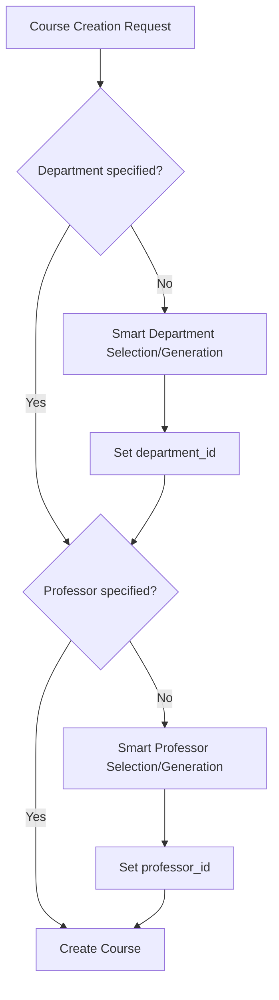

# Smart Department and Professor Selection/Generation Feature

## Overview

This feature enhances course creation by intelligently selecting or generating departments and professors when they are not explicitly specified. Instead of requiring users to manually specify `department_id` and `professor_id` upfront, the system uses AI to make smart decisions based on course details.

## Core Concept

When creating a course:

1. **Department Resolution**: If `department_id` is not provided, the AI examines existing departments and either:
   - Selects the best matching existing department, OR
   - Determines that a new department should be generated based on the course details
2. **Professor Resolution**: If `professor_id` is not provided, the AI examines professors within the resolved department and either:
   - Selects the best matching existing professor, OR
   - Determines that a new professor should be generated based on the course and department details

## Workflow



## Implementation Architecture

### Enhanced CourseService

Instead of creating a new orchestration service, we enhance the existing `CourseService.create_course` method to handle smart selection when IDs are missing:

```python
class CourseService:
    def __init__(
        self,
        repository_factory: RepositoryFactory,
        professor_service: ProfessorService,
        department_selector_service: DepartmentSelectorService,  # New
        professor_selector_service: ProfessorSelectorService,    # New
        logger=None,
    ):
        # Enhanced dependencies

    async def create_course(
        self,
        title: str,
        code: str,
        level: str,
        department_id: Optional[str] = None,
        professor_id: Optional[str] = None,
        # ... other fields
    ) -> Tuple[Course, Professor]:
        """Enhanced to handle smart selection when IDs are missing."""

        # 1. Resolve department_id if missing
        if not department_id:
            department_id = await self.department_selector_service.resolve_department(
                course_attributes={'title': title, 'code': code, 'level': level, ...}
            )

        # 2. Resolve professor_id if missing
        if not professor_id:
            professor_id = await self.professor_selector_service.resolve_professor(
                course_attributes={'title': title, 'code': code, 'level': level, ...},
                department_id=department_id
            )

        # 3. Proceed with normal course creation
        # ... existing course creation logic
```

### New Selection Services

#### DepartmentSelectorService

- **`resolve_department(course_attributes)`**: Returns existing department ID or creates new one
- **`select_existing_department(course_attributes, existing_departments)`**: AI decides which existing department fits best
- Uses existing `DepartmentGeneratorService` when new department is needed

#### ProfessorSelectorService

- **`resolve_professor(course_attributes, department_id)`**: Returns existing professor ID or creates new one
- **`select_existing_professor(course_attributes, department_professors)`**: AI decides which existing professor fits best
- Uses existing `ProfessorGeneratorService` when new professor is needed

## AI Prompting Strategy

### Simplified Selection Prompts

The AI prompts focus solely on the SELECT vs GENERATE decision, keeping generation logic separate:

**Department Selection**: Analyzes course details against all existing departments. Returns either:

- `SELECT` with the best matching department ID
- `GENERATE` when no existing department is a good fit

**Professor Selection**: Analyzes course details against professors in the resolved department. Returns either:

- `SELECT` with the best matching professor ID
- `GENERATE` when no existing professor is a good fit

When `GENERATE` is chosen, the system delegates to existing generator services (`DepartmentGeneratorService` or `ProfessorGeneratorService`) with course context.

## Simplified Implementation Tasks

### Phase 1: Selection Services

- [ ] **Create DepartmentSelectorService** - Simple SELECT vs GENERATE decision logic
- [ ] **Create ProfessorSelectorService** - Simple SELECT vs GENERATE decision logic
- [ ] **Update selection prompts** - Remove generation details, focus on selection only

### Phase 2: CourseService Integration

- [ ] **Enhance CourseService.create_course** - Add smart selection when IDs are missing
- [ ] **Update dependency injection** - Wire new selector services
- [ ] **Basic error handling** - Graceful fallback when selection fails

### Phase 3: Testing & Validation

- [ ] **Unit tests for selector services** - Test selection logic without expensive API calls
- [ ] **Integration tests for enhanced course creation** - Verify end-to-end workflow
- [ ] **Manual testing with real courses** - Validate AI decision quality

## Configuration

No new configuration required! The feature uses existing settings:

- Uses `DEPARTMENT_GENERATION_MODEL` for department selection decisions
- Uses `PROFESSOR_GENERATION_MODEL` for professor selection decisions
- Feature is enabled by default - no feature flags needed
- No artificial limits on departments or professors shown to AI

## Error Handling

Simple and practical error handling:

1. **Selection fails**: Log error and require manual department/professor specification
2. **Generation fails**: Propagate error from existing generator services
3. **Parse failures**: Fall back to manual selection

## Testing Approach

Lightweight testing focused on code validation:

- **Unit tests**: Test selection logic and decision parsing (without expensive API calls)
- **Integration tests**: Verify service wiring and error handling
- **Manual validation**: Test real course creation scenarios during development

No automated AI quality testing since it requires expensive API tokens.

## Future Enhancements

1. **Multi-Professor Courses**: Handle courses taught by multiple professors
2. **Cross-Department Courses**: Handle interdisciplinary courses
3. **Temporal Awareness**: Consider professor availability/teaching load
4. **Specialization Matching**: More sophisticated matching based on research areas
5. **Learning from Patterns**: Improve suggestions based on historical course creation patterns

## Benefits

1. **Reduced User Friction**: Users can create courses without deep knowledge of existing departments/professors
2. **Intelligent Organization**: AI ensures courses are properly categorized and assigned
3. **Consistency**: Reduces duplicate or poorly-organized departments/professors
4. **Scalability**: System grows intelligently as content is added
5. **User Experience**: Makes course creation more intuitive and guided

## Risks and Mitigation

1. **AI Accuracy**: Mitigated by confidence thresholds and human review options
2. **Performance**: Mitigated by caching and optimized prompts
3. **Complexity**: Mitigated by incremental development and comprehensive testing
4. **User Trust**: Mitigated by transparent decision explanations and override options
